<h1> Proyecto de Seminario de Traductores de Lenguajes 2 </h1>
<h2> Autor: Bustos Ruiz Daniel </h2>
<h2> Seccion: D02 </h2>
<h2> Codigo: 215466901 </h2>

<h3> Etapa #1: Analizador Lexico </h3>
En esta etapa la practica consiste en hacer que el programa reconozca los tokens que recibe por entrada, esto con el fin de determinar que tipo de token es el que se recibe y si es que existe.
A continuacion se muestran los tokens que debe reconocer el compilador:

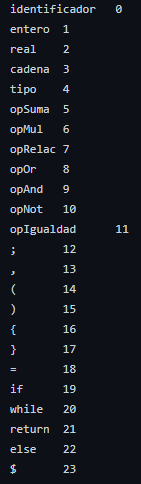

Reconocimiento de tokens:

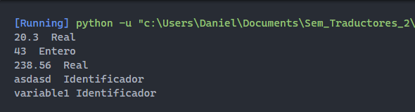

<h3> Etapa #2: Analisis Sintactico </h3>
Esta estapa solo es para demostrar como funciona la pila y como es que se validan las entradas recibidas.
Este proceso se hace gracias a una gramatica, esta se define a partir de cierto numero de reglas y una tabla la cual se encuentra en los archivos de este repositorio llamado 'compilador.lr'

Al ser un ejemplo tan extenso solo se muestra la siguiente captura la cual muestra como es que funciona la pila y acepta una cadena

Entrada:

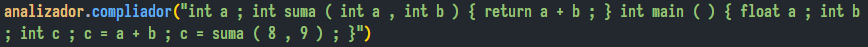

Pila:

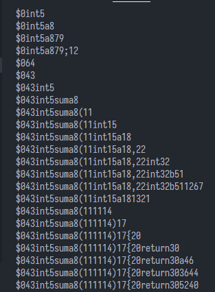

<h3> Etapa #3: Arbol Sintactico </h3>
Ahora para demostrar que el analisis sintactico funciona se realiza el recorrido del arbol sintactico.
Para esto se hace uso de nodos, los cuales son almacenados dentro de cada elemento pila no terminal.
Cada que se realiza una reduccion en el analisis sintactico el nodo se encarga de guardar todos esos elementos que se eliminan que a su vez pueden ser otros no terminales los cuales contienen nodos que tambien eliminaron mas elementos.

Al final se muestra el recorrido completo del arbol:

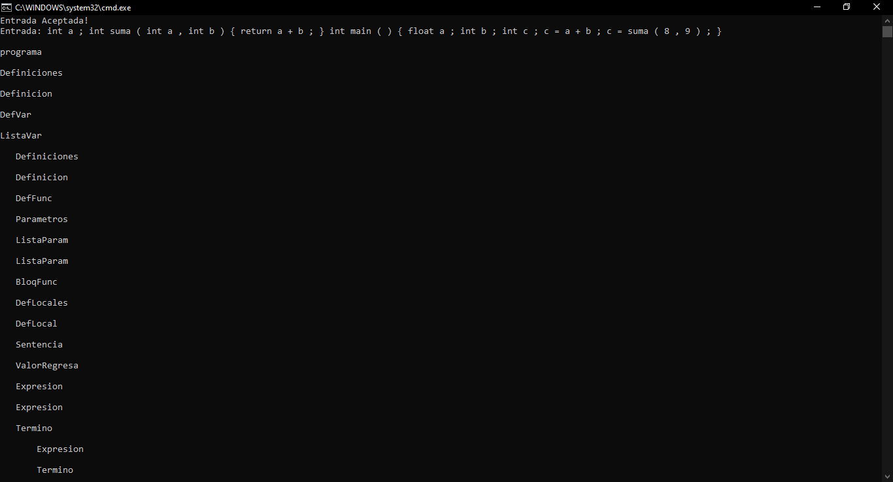
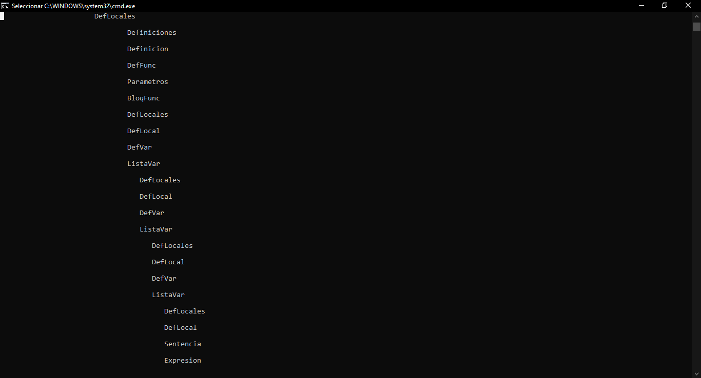
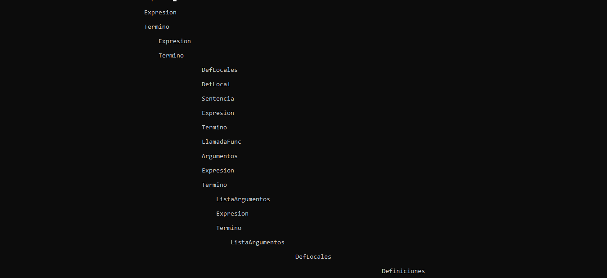

<h3> Etapa #4: Analizador Semantico </h3>
En la etapa actual se muestra el arbol sintactico a la hora de ejecutar el programa.
Al finalizar muestra tanto la tabla de simbolos y la tabla de errores.

El ejemplo en la etapa actual es con la siguiente entrada:


El resultado de la tabla de simbolos es la siguiente:


<h3> Etapa Final: Generacion de Codigo </h3>

Esta etapa consiste en crear un archivo ASM (Assembly Languaje) el cual seria la representacion de la entrada en lenguaje ensamblador, con este archivo se genera un ejecutable el cual muestra la salida del programa.

La entrada que se utiliza para esta etapa final es la siguiente:

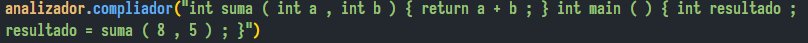

Se realiza el recorrido del arbol sintactico para la creacion del archivo ASM el cual da como resultado el siguiente resultado:
```
.386
.model flat, stdcall
option casemap:none

include c:\masm32\include\masm32rt.inc

.code

suma proc a:DWORD,b:DWORD
mov eax, a
add eax, b
ret
suma endp

main proc
local resultado:DWORD
mov eax, 8
push eax
mov eax, 5
push eax
call suma
mov resultado, eax
mov eax, resultado
print str$(eax)
invoke ExitProcess, 0

main endp
end main
```
Este archivo es la traduccion en codigo ensamblador.
Al no existir una funcion "print" en el lenguaje, cada que se realiza una asignacion se imprime en pantalla en el archivo asm la el valor de la variable a la que se le realizo la asgnacion.
Al terminar de realizar todo el analisis semantico el programa crea un archivo .bat el cual se encarga de ejecutar las instrucciones necesarias para crear el archivo ejecutable, el archivo utiliza las instrucciones del programa MASM32 para generar tanto el archivo .obj y .exe.

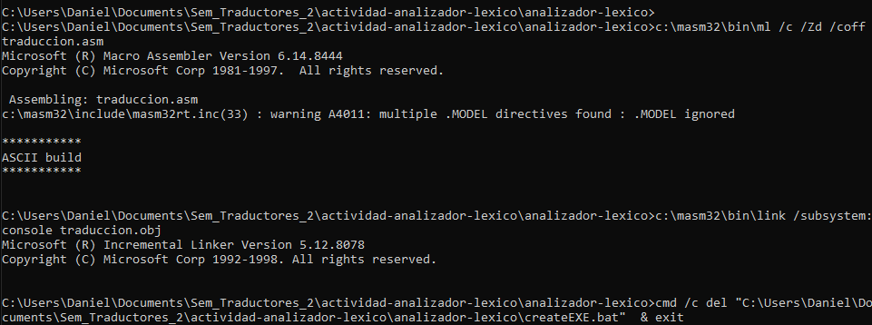

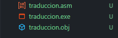

Al ejecutar el archivo .exe simplemente muestra la salida la cual seria la siguiente:

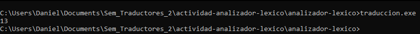
