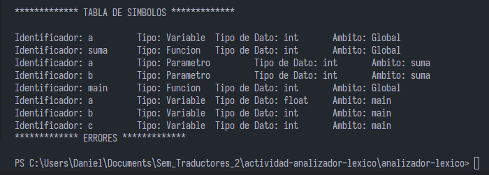

<h3> Etapa Actual: Analizador Semantico </h3>
En la etapa actual se muestra el arbol sintactico a la hora de ejecutar el programa.
Al finalizar muestra tanto la tabla de simbolos y la tabla de errores.

El ejemplo en la etapa actual es con la siguiente entrada:

El resultado de la tabla de simbolos es la siguiente:

